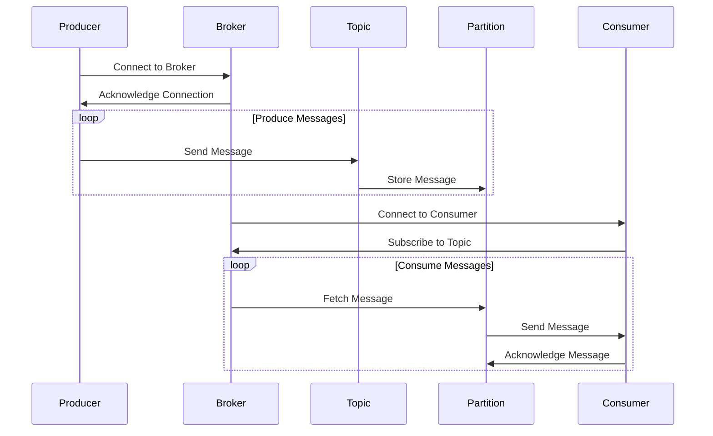
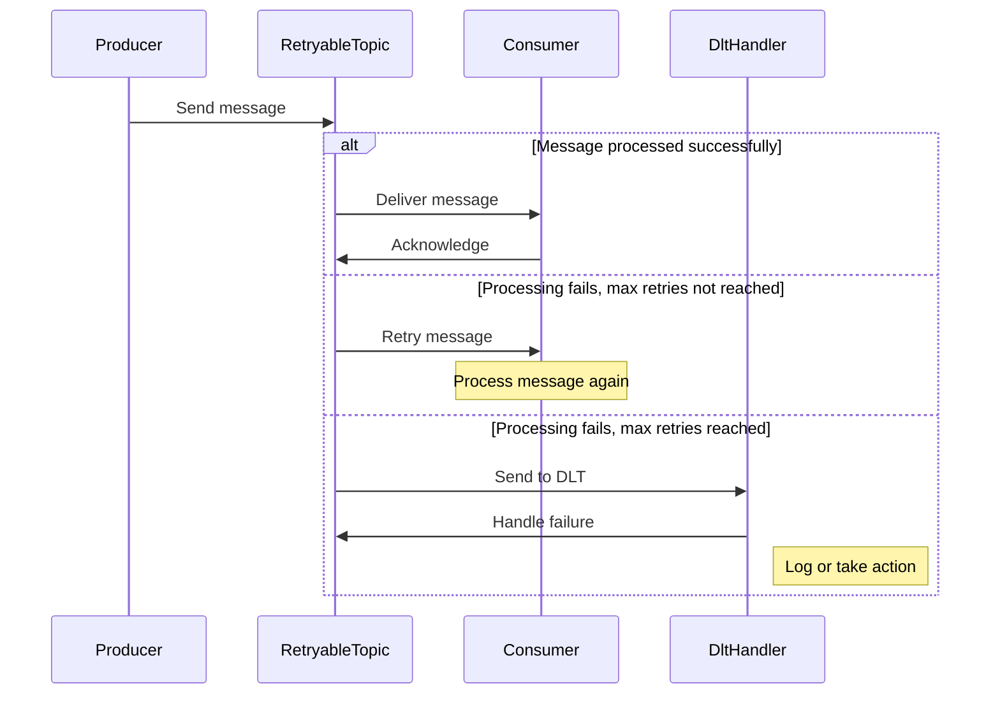
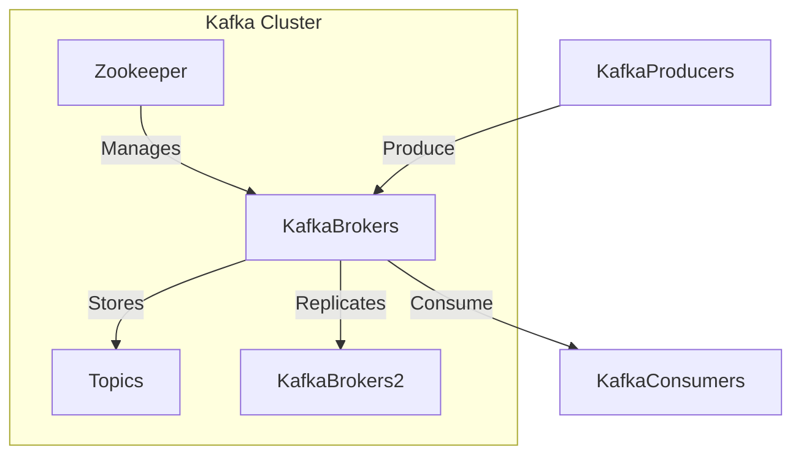
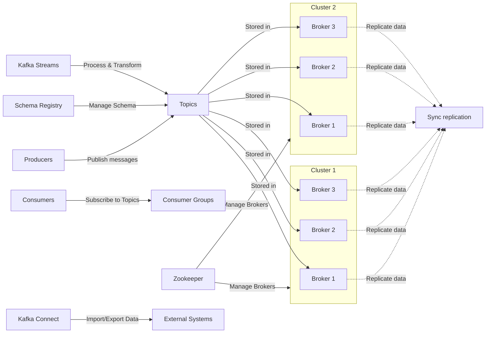
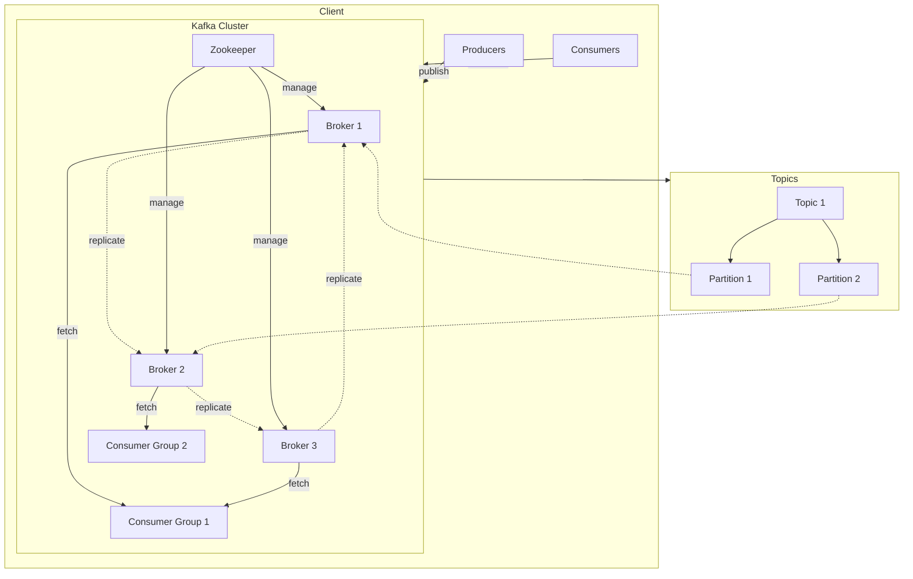
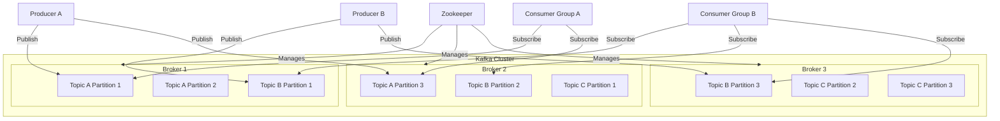
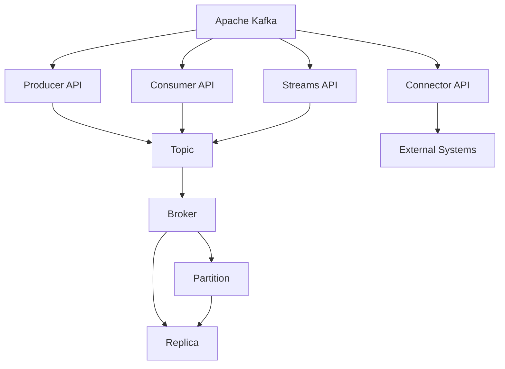

# 📌 spring-boot-kafka-service

# Table of Contents

1. [Introduction](#introduction)
2. [Description](#description)
3. [Features](#features)
   4[Usage](#usage)
5. [Key Concepts](#key-concepts)
    - [Kafka Cluster](#kafka-cluster)
    - [Kafka Broker](#kafka-broker)
    - [Kafka Producer](#kafka-producer)
    - [Kafka Consumer](#kafka-consumer)
    - [Kafka Topics](#kafka-topics)
    - [Partitions](#partitions)
    - [Offsets](#offsets)
    - [Consumer Groups](#consumer-groups)
    - [Serialization](#serialization)
6. [Demo Application](#demo-application)
7. [Diagrams](#diagrams)
    - [Kafka - Sequence Diagram](#kafka---sequence-diagram)
    - [Kafka - Sequence Diagram - Error Handling Implementation](#kafka---sequence-diagram---error-handling-implementation)
    - [Kafka - Flow Diagram - 1](#kafka---flow-diagram---1)
    - [Kafka - Flow Diagram - 2](#kafka---flow-diagram---2)
    - [Kafka - Flow Diagram - 3](#kafka---flow-diagram---3)
    - [Kafka - Flow Diagram - 4](#kafka---flow-diagram---4)
    - [Kafka - Block Diagram](#kafka---block-diagram)
8. [Apache Kafka Commands](#apache-kafka-commands)
    - [Prerequisites](#prerequisites)
    - [Steps - For Open Source Kafka Server](#steps---for-open-source-kafka-server)
    - [API Details](#api-details)
        - [1. Setup Kafka Server](#1-setup-kafka-server)
        - [2. Start Server](#2-start-server)
        - [3. Stop Server](#3-stop-server)
        - [4. Create Topic](#4-create-topic)
        - [5. Get All Topics](#5-get-all-topics)
        - [6. Get Topic Details](#6-get-topic-details)
        - [7. Delete Topic](#7-delete-topic)
        - [8. Delete Kafka Logs](#8-delete-kafka-logs)
        - [9. Publish Message](#9-publish-message)
        - [10. Send Events](#10-send-events)
        - [11. Publish Events (Error Handling)](#11-publish-events-error-handling)
    - [API Summary](#api-summary)
        - [Overview](#overview)
        - [API Endpoints](#api-endpoints)
9. [Front End App Details](#Front-End-App-Details)
10. [Postman Collection](#Postman-Collection)

## Introduction

Spring Boot application for interacting with Apache Kafka.

- This contains 4 modules
    1. spring-boot-common-kafka-utility-service
    2. spring-boot-kafka-producer
    3. spring-boot-kafka-consumer
    4. spring-boot-kafka-producer-consumer-error-handling

## Description

This service enables communication with Apache Kafka through RESTful APIs. It consists of 4 modules:

- `spring-boot-common-kafka-utility-service` : Common Utility for Kafka Server
- `spring-boot-kafka-producer`: Allows publishing messages to Kafka topics.
- `spring-boot-kafka-consumer`: Facilitates consuming messages from Kafka topics.
- `spring-boot-kafka-producer-consumer-error-handling`: Error handling implementation in Producer and Consumer.

## Features

- Sequence and flow diagrams illustrating Kafka message flow.
- Apache Kafka command usage for various operations.
- RESTful APIs for managing Kafka topics and messages.
- Detailed descriptions and examples for each API endpoint.

## Kafka Auto Setup

This service can **automatically set up Kafka** based on system properties.

## Usage

Users can interact with the service via its RESTful API endpoints to manage Kafka topics and messages effectively.

For detailed usage instructions and examples, refer to the API documentation in the respective service modules.

## Key Concepts

Apache Kafka is a distributed, fault-tolerant, and highly scalable message broker and stream processing platform. It was
originally developed by LinkedIn and later open-sourced as an Apache Software Foundation project. Kafka is designed to
handle large volumes of data streams in a real-time and fault-tolerant manner.

Key Components of Kafka:
Producer: An application that publishes messages to Kafka topics.

- **Consumer**: An application that subscribes to topics and processes the published messages.
- **Broker**: Kafka brokers form the core of the Kafka cluster, storing and managing the streams of records.
- **Topic**: A category or feed name to which records are published. Topics in Kafka are used to categorize messages.
- **Partition**: Topics are divided into partitions, allowing Kafka to parallelize processing and scale horizontally.
- **Zookeeper**: Kafka relies on Apache ZooKeeper for distributed coordination and management of the Kafka cluster.
  

### Kafka Cluster

A Kafka cluster is a group of one or more Kafka brokers (servers) working together to manage the storage and exchange of
data in the form of messages. Kafka is designed to operate as a distributed system, and a cluster allows it to scale
horizontally, provide fault tolerance, and handle large volumes of data across multiple nodes.


### Kafka Broker

Kafka brokers form the core of the Kafka cluster, storing and managing the streams of records.


### Kafka Producer

Producers are applications or systems that publish messages to Kafka topics. Producers determine which partition within
a topic a message should be sent to.


### Kafka Consumer

Consumers are applications or systems that subscribe to Kafka topics and process the messages. Consumers can be part of
a consumer group, allowing them to parallelize the processing of messages.


### Kafka Topics

A Kafka topic is a category or feed name to which records (messages) are published. Topics help organize and categorize
messages.

---

### Partitions

Topics are divided into partitions, allowing for parallel processing and scalability. Each partition is assigned to a
specific broker.

---

### Offsets

Offsets represent the position of a message within a partition. Consumers use offsets to track their progress and resume
processing from the last committed offset.

---

### Consumer Groups

Consumer groups allow for parallel and scalable message processing. Consumers within a group coordinate to consume
messages from one or more partitions.

---

### Serialization

Serialization is the process of converting data to a format suitable for transmission. Kafka allows custom serializers
for key and value objects.

## Demo Application


## Diagrams

### Kafka - Sequence Diagram



### Kafka - Sequence Diagram - Error Handling Implementation



### Kafka - Flow Diagram - 1



### Kafka - Flow Diagram - 2



### Kafka - Flow Diagram - 3



### Kafka - Flow Diagram - 4



### Kafka - Block Diagram



# Apache Kafka Commands

This README provides a guide on how to use Apache Kafka with various commands.

## Prerequisites

Before running Kafka commands, make sure you have Kafka installed on your system. If not, download and install it from
the [official website](https://kafka.apache.org/downloads).

## Steps - FOr Open Source Kafka Server

1. **Go to Kafka Installation Directory**: Navigate to the Kafka server installation directory on your system. For
   example:
    ```bash
    cd C:\Softwares\Kafka\kafka\bin\windows
    ```

2. **Start Zookeeper Server**: Open a command prompt and run the following command to start the Zookeeper server:
    ```bash
    ./zookeeper-server-start.bat ../../config/zookeeper.properties
    ```

3. **Start Kafka Server**: Open another command prompt and run the following command to start the Kafka server:
    ```bash
    ./kafka-server-start.bat ../../config/server.properties
    ```

4. **Create a Topic**: Use the following command to create a topic named `my-topic`:
    ```bash
    ./kafka-topics.bat --create --bootstrap-server localhost:9092 --replication-factor 1 --partitions 1 --topic my-topic
    ```

5. **List All Topics**: Run the following command to list all topics available in your Kafka cluster:
    ```bash
    ./kafka-topics.bat --list --bootstrap-server localhost:9092
    ```

6. **Delete a Topic**: To delete a topic, replace `<topic_name>` with the name of the topic you want to delete and run
   the following command:
    ```bash
    ./kafka-topics.bat --delete --topic <topic_name> --bootstrap-server localhost:9092
    ```

7. **Start a Producer**: Use the following command to start a Kafka producer for the `my-topic` topic:
    ```bash
    ./kafka-console-producer.bat --broker-list localhost:9092 --topic my-topic
    ```

8. **Start a Consumer**: Run the following command to start a Kafka consumer for the `my-topic` topic, consuming
   messages from the beginning:
    ```bash
    ./kafka-console-consumer.bat --bootstrap-server localhost:9092 --topic my-topic --from-beginning
    ```

9. **Stop Kafka Server**: To stop the Kafka server, run the following command:
    ```bash
    ./kafka-server-stop.bat
    ```

10. **Stop Zookeeper Server**: Finally, stop the Zookeeper server by running the following command:
    ```bash
    ./zookeeper-server-stop.bat
    ```

## API Details

### 1. Start Server

- **URL** - http://localhost:8081/api/v1/kafka-service/kafka/start-server
- **HTTP Method** - POST
- **Description:** Start the Kafka server.

- **Response**

````
{
    "status": "Zookeeper and Kafka servers started successfully."
}
````

### 2. Stop Server

- **URL** - http://localhost:8081/api/v1/kafka-service/kafka/stop-server
- **HTTP Method** - POST
- **Description:** Stop the Kafka server.

- **Response**

````
{
    "status": "Zookeeper and Kafka servers stopped successfully."
}
````

### 3. Create Topic

- **URL** - http://localhost:8081/api/v1/kafka-service/kafka/create-topic?topicName={topic-name}&partition={partition}
- **HTTP Method** - POST
- **Description:** Creates a new Kafka topic with the specified name and partition.
- **Request Parameters:**
    - `topicName`: Name of the Kafka topic to create.
    - `partition`: Number of partitions for the new topic.

- **Response**

````
{
    "status": "Topic -[topic-name]  created successfully"
}
````

### 4. Get All Topics

- **URL** - http://localhost:8081/api/v1/kafka-service/kafka/topic
- **HTTP Method** - GET
- **Description:**  Retrieves a list of all existing Kafka topics.

- **Response**

````
[
  "topic1",
  "topic2",
  "topic3"
]
````

### 5. Get Topic Details

- **URL** - http://localhost:8081/api/v1/kafka-service/kafka/topic/details?topicName={topic-name}
- **HTTP Method** - GET
- **Description:**  Retrieves a list of all existing Kafka topics.
- **Request Parameters:**
    - `topicName`: Name of the Kafka topic to create.

- **Response**

````
{
    "name": "kafka-demo",
    "numPartitions": 1,
    "partitions": [
        {
            "partition": "0",
            "leader": {
                "empty": false
            },
            "replicas": [
                {
                    "empty": false
                }
            ],
            "isr": [
                {
                    "empty": false
                }
            ]
        }
    ]
}
````

### 6. Delete Topic

- **URL** - http://localhost:8081/api/v1/kafka-service/kafka/topic?topicName={topic-name}
- **HTTP Method** - DELETE
- **Description:**  Deletes the specified Kafka topic.
- **Request Parameters:**
    - `topicName`: Name of the Kafka topic to create.

- **Response**

````
{
  "status": "Topic deleted successfully",
  "errorMessage": null
}
````

### 7. Delete Kafka Logs

- **URL** - http://localhost:8081/api/v1/kafka-service/kafka/logs
- **HTTP Method** - DELETE
- **Description:**  Deletes the kafka logs.

- **Response**

````
{
    "status": "Kafka and Zookeeper logs deleted successfully"
}
````

### 8. Publish Message

- **URL** - http://localhost:8082/api/v1/kafka-service/publish
- **HTTP Method** - GET
- **Description:**  Publishes a message to a Kafka topic.

- **Response**

````
{
  "status": "Message published successfully",
  "errorMessage": null
}
````

### 9. Send Events

- **URL** - http://localhost:8082/api/v1/kafka-service/publish
- **HTTP Method** - POST
- **Description:**  Publishes events to a Kafka topic.
- **Request Body:** Customer object containing event details.

- **Request**

````
{
  "id": 123,
  "name": "Siddhant Patni",
  "email": "siddhant4patni@gmail.com"
}
````

- **Response**

````
{
  "status": "Events published successfully",
  "errorMessage": null
}
````

### 10. Publish Events (Error Handling)

- **URL** - http://localhost:8084/api/v1/kafka-service/error-handling/producer
- **HTTP Method** - POST
- **Description:**  Publishes events to a Kafka topic for Error handling.

- **Response**

````
{
    "status": "Message published successfully"
}
````

## API Summary

### Overview

This document outlines the API endpoints provided by the Kafka Service for managing Kafka topics, publishing messages,
and handling errors.

### API Endpoints

### 1. Setup Kafka Server

- **URL:** http://localhost:8081/api/v1/kafka-service/kafka/setup
- **Method:** POST
- **Description:** The **Kafka Setup Endpoint** in this Spring Boot service allows users to dynamically set up Kafka. Users can choose between automatic setup or specifying a custom directory for Kafka installation.

### **Request Parameters**

| Parameter                    | Type    | Required | Description                                                                                   |
|------------------------------|---------|----------|-----------------------------------------------------------------------------------------------|
| kafkaAutoSetupRequired       | boolean | Yes      | Enables or disables automatic Kafka setup.                                                    |
| kafkaUserDefinedPathRequired | boolean | Yes      | Specifies if a custom Kafka installation path is required.                                    |
| kafkaUserDefinedPath         | String  | No       | Custom path where Kafka should be installed. Required if `kafkaUserDefinedPathRequired=true`. |

### **Example Request**

#### **1. Automatic Kafka Setup**

```
POST http://localhost:8081/api/v1/kafka-service/kafka/setup?kafkaAutoSetupRequired=true&kafkaUserDefinedPathRequired=false
```

#### **2. User Defined Kafka Path Setup**

```
POST http://localhost:8081/api/v1/kafka-service/kafka/setup?kafkaAutoSetupRequired=true&kafkaUserDefinedPathRequired=true&kafkaUserDefinedPath=C:\Users\Kafka\Setup
```

## Response Structure

### **Success Response**

```json
{
  "status": "Kafka setup completed successfully."
}
```

### **Setup Skipped Response**

```json
{
  "status": "Kafka setup skipped."
}
```

### **Error Response**

```json
{
  "errorMessage": "An unexpected error occurred during Kafka setup."
}
```

### 2. Start Server

- **URL:** http://localhost:8081/api/v1/kafka-service/kafka/start-server
- **Method:** POST
- **Description:** Starts the Kafka server.
- **Response:**
    - Status: Zookeeper and Kafka servers started successfully.

### 3. Stop Server

- **URL:** http://localhost:8081/api/v1/kafka-service/kafka/stop-server
- **Method:** POST
- **Description:** Stops the Kafka server.
- **Response:**
    - Status: Zookeeper and Kafka servers stopped successfully.

### 4. Create Topic

- **URL:** http://localhost:8081/api/v1/kafka-service/kafka/topic
- **Method:** POST
- **Description:** Creates a new Kafka topic.
- **Request Parameters:**
    - topicName: Name of the Kafka topic.
    - partition: Number of partitions for the new topic.
- **Response:**
    - Status: Topic created successfully.

### 5. Get All Topics

- **URL:** http://localhost:8081/api/v1/kafka-service/kafka/topic
- **Method:** GET
- **Description:** Retrieves a list of all existing Kafka topics.
- **Response:**
    - List of topic names.

### 6. Get Topic Details

- **URL:** http://localhost:8081/api/v1/kafka-service/kafka/topic/details?topicName={topic-name}
- **Method:** GET
- **Description:** Retrieves details of a specific Kafka topic.
- **Request Parameters:**
    - topicName: Name of the Kafka topic.
- **Response:**
    - Details of the specified Kafka topic.

### 7. Delete Topic

- **URL:** http://localhost:8081/api/v1/kafka-service/kafka/topic?topicName={topic-name}
- **Method:** DELETE
- **Description:** Deletes a Kafka topic.
- **Request Parameters:**
    - topicName: Name of the Kafka topic.
- **Response:**
    - Status: Topic deleted successfully.

### 8. Delete Kafka Logs

- **URL:** http://localhost:8081/api/v1/kafka-service/kafka/logs
- **Method:** DELETE
- **Description:** Deletes Kafka logs.
- **Response:**
    - Status: Kafka and Zookeeper logs deleted successfully.

### 9. Publish Message

- **URL:** http://localhost:8082/api/v1/kafka-service/publish
- **Method:** GET
- **Description:** Publishes a message to a Kafka topic.
- **Response:**
    - Status: Message published successfully.

### 10. Send Events

- **URL:** http://localhost:8082/api/v1/kafka-service/publish
- **Method:** POST
- **Description:** Publishes events to a Kafka topic.
- **Request Body:** Customer object containing event details.
- **Response:**
    - Status: Events published successfully.

### 11. Publish Events (Error Handling)

- **URL:** http://localhost:8084/api/v1/kafka-service/error-handling/producer
- **Method:** POST
- **Description:** Publishes events to a Kafka topic for error handling.
- **Response:**
    - Status: Message published successfully.

### Front End App Details

- App Name - react-kafka-manager-ui
- Platform - ReactJS
- repo URL - https://github.com/siddhantpatni0407/react-kafka-manager-ui.git
- URL - http://localhost:3000

## Postman Collection

```
https://github.com/siddhantpatni0407/spring-boot-kafka-service/tree/master/postman_collection/collection/spring-boot-kafka-service.postman_collection.json
```